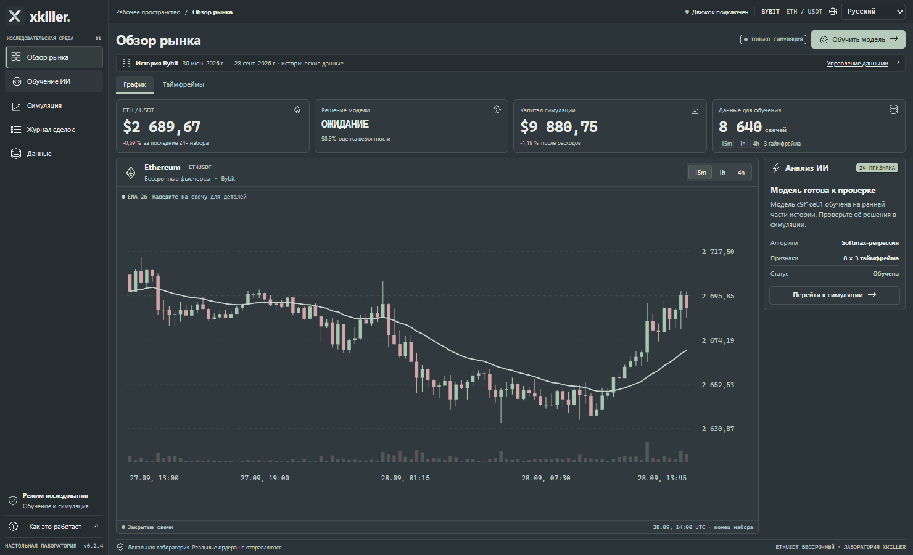

# Xkiller

A local research lab for learning and testing ETHUSDT perpetual futures strategies on **Bybit**. Built with **C# / .NET 10**, **Electron**, **TypeScript**, and **Svelte 5**. Available in Russian, English, Ukrainian, Korean, Japanese, and Simplified Chinese. Project documentation is in English.

Xkiller trains a real, reproducible classifier on technical indicators, then simulates its decisions on a later section of history. It is a research application, not a proven profitable trading system. **No exchange credentials or real order submission are implemented.**



## Download

Download the Windows x64 portable executable from [GitHub Releases](https://github.com/glitchykid/xkiller/releases/latest). It bundles Electron and the .NET runtime. Release assets include a SHA-256 checksum. Builds are currently unsigned.

## Appearance

Every screen uses a **compact, dark minimalist interface** with **Gunmetal (`#2A3439`) as its primary color**. Opaque panels, fine borders and clear typography organize research data. Quiet sage actions and subdued green/rose results provide useful emphasis. Blue accents, neon lighting, glass blur and decorative wallpaper are absent.

Short headers, 8 px gaps, 30 px controls and dense forms keep the workspace compact. Each section has internal tabs, so its content fits the supported desktop window without scrolling. The default window is 1180 × 760; the minimum is 1024 × 720. The layout is also verified with a 1024 × 660 renderer area to allow for native window chrome. Below 1200 px, navigation contracts to an icon rail with accessible names and hover labels.

Training separates settings, quality and feature weights. Simulation separates settings, results and experiment history. The trade journal separates execution details from costs and exit reasons. Tables use pages sized to the available height; every record remains available, and CSV export still contains the complete ledger. Form values survive tab changes. Arrow keys, Home and End navigate the internal tabs. Visual identity comes from the generated minimal X icon and consistent Gunmetal surfaces.

Select a language in the top bar; it applies immediately and persists across restarts. A new profile starts in Russian. The app stays dark regardless of the OS or earlier light-theme settings, while preserving language and research data. See the [design system](docs/DESIGN.md) and [localization guide](docs/LOCALIZATION.md).

A generated flat X monogram on opaque Gunmetal identifies the Windows executable, window, sidebar and browser tab. Inside the app, sixteen generated raster PNG glyphs have transparent backgrounds and antialiased edges; no SVG icons are used. Charts use smooth geometric rendering. All graphics are bundled locally. [Asset locations and generation prompts](docs/ASSETS.md) document the visual identity.

## What works

- Public Bybit historical import: 30–360 days of closed 15-minute ETHUSDT linear perpetual candles and funding events, with pagination, continuity checks, bounded HTTP retries, cancellation, and atomic dataset replacement.
- Multi-timeframe analysis: 15m, 1h, 4h; EMA, RSI, MACD, ATR, Bollinger bands, relative volume, and momentum.
- Actual model training: L2-regularized three-class softmax regression implemented in C#, fitted feature scaling, chronological 60/20/20 split, purged boundaries, and validation-based epoch selection.
- Historical paper simulation: long/short/flat, next-bar entries, 1–10× leverage, risk-based position size, margin cap, ATR stops, take profit, maximum holding time, trading fees, slippage, funding, and a drawdown halt.
- Validation/test classification metrics, majority-class baseline, training curves, model coefficients, equity curve, full trade ledger, and up to 20 runs per current model.
- Local persistence; JSON model/report export and complete CSV trade export.
- Reproducible, prominently labeled synthetic demo for offline functional testing.
- Isolated Electron renderer, narrow IPC bridge, loopback-only C# service with a per-launch random authentication token, and self-contained Windows packaging.

## Run the desktop application

Requirements for development: **Node.js 24.21.0 LTS**, **.NET SDK 10.0.401 LTS**, and Windows x64. `.nvmrc` and `global.json` record the verified toolchain. Dependencies are pinned in `package-lock.json`. The Windows portable build bundles its own .NET runtime, so the end user does not need the SDK.

Verified stable dependencies: Electron 44.4.5, Svelte 5.57.1, Vite 8.3.1, and TypeScript 7.0.2. TypeScript 7 checks Electron and shared code through the `typescript-native` npm alias. Svelte Check 4.7.6 still requires the TypeScript 5/6 programmatic API, so TypeScript 6.0.3 is retained exclusively for that compatibility path. No peer dependency overrides or prerelease compilers are used.

```powershell
npm ci
npm run dev
```

`npm run dev` builds C#, starts Vite, and opens Electron. If the SDK is installed outside PATH, set `DOTNET_EXE` to its full executable path before running development or packaging scripts.

```powershell
$env:DOTNET_EXE = 'C:\path\to\dotnet.exe'
npm run dev
```

For browser-based local verification, run `npm run dev:web` and open `http://127.0.0.1:5173`. This development server is local only; do not expose or deploy its authenticated proxy publicly.

## First experiment

1. Select **English** in the top bar, open **Data**, and click **Import Bybit data**. The initial dataset is synthetic and clearly labeled.
2. Open **AI training**. Choose a prediction horizon and movement threshold, then train.
3. Training opens the **Quality** tab when complete. Compare test accuracy with the majority-class baseline and inspect validation loss; **Features** shows model weights. A better classification score alone does not establish trading profitability.
4. Open **Simulation**, review the execution assumptions and risk settings, and run the historical simulation.
5. The completed simulation opens **Result**. Inspect its equity curve, **History**, and **Trade journal** pages. Export the full JSON report and CSV ledger for independent analysis.

The default 0.50 probability threshold can produce zero trades. That is a valid outcome when the model mostly predicts the flat class. Lowering it changes the experiment; it is not evidence of a better strategy. Repeatedly tuning parameters against the same test interval consumes that interval's usefulness as an independent test.

Loading a new dataset resets the current model and its simulations. Retraining replaces the model and clears its simulations. Export valuable results before either action. Failed or cancelled jobs retain the previous committed workspace.

## Build and verify

```powershell
npm run check        # Svelte + TypeScript diagnostics
npm run test         # 17 C# + 9 client checks + 2 raster asset checks
npm run build        # UI, Electron bridge, C# service
npm run package      # Windows x64 portable application, including .NET runtime
```

Output: `release/Xkiller-0.2.4-x64.exe`. This build is unsigned. `release/win-unpacked/Xkiller.exe` is the unpacked application. GitHub Actions performs checks and uploads the portable executable as a workflow artifact.

To publish a new version, update `package.json` and its lockfile, add English notes at `docs/releases/<version>.md`, verify locally, commit, and push a matching `v<version>` tag. The release workflow validates the version, runs all tests and type checks, packages Windows x64, computes SHA-256, and publishes both assets using the repository's built-in `GITHUB_TOKEN`. No personal access token is required. Actions must be enabled and permitted to write releases.

## Data and state

- Development: `.local/workspace/workspace.json`.
- Packaged Electron: a `workspace` directory below Electron's `userData` location (normally `%APPDATA%\xkiller` or `%APPDATA%\Xkiller`).
- `XKILLER_DATA` overrides the workspace directory for isolated verification.
- Language is stored separately in `userData/preferences.json`. Legacy theme fields are ignored and removed on the next language save. Browser development uses local storage. Language settings never replace market history or model data.
- The workspace contains market history, funding, model parameters, risk settings, and simulation runs. Writes use a temporary file and atomic replacement; malformed existing files are preserved and cause startup to fail rather than silently resetting research.
- Nothing in `.local/`, `artifacts/`, `release/`, or dependency folders is committed.

## Project layout

```text
backend/Xkiller.Core/    Market data, indicators, training, simulation
backend/Xkiller.Api/     Local API, cancellable jobs, persistence
electron/               Process lifecycle, validated IPC, native exports
src/                    Svelte UI and reusable chart components
shared/                 Preference validation and locale-aware translation
build/                  Generated icon source and Windows ICO
public/                 Local UI and browser icon
scripts/                Development and packaging orchestration
tests/Xkiller.Tests/     Deterministic scientific and accounting checks
docs/                   Architecture, methodology, verification record
```

Read [architecture](docs/ARCHITECTURE.md), [methodology and limitations](docs/METHODOLOGY.md), and [verification](docs/VERIFICATION.md) before interpreting results.

Follow the [TDD development workflow and boundary checklist](docs/DEVELOPMENT.md) for new behavior and fixes.

## Scope and limitations

This first vertical slice implements supervised research and historical simulation. It does not implement reinforcement learning, automatic hyperparameter search, continuous online retraining, live paper execution, testnet orders, or live trading. Such systems require additional execution, reconciliation, and validation work. There is no claim of an established trading edge.

The simulator uses OHLC bars rather than a tick/order-book replay. Liquidation and funding valuation are approximate; fee and maintenance-margin settings are user assumptions, not an automatic account-specific Bybit fee schedule. Consult the methodology for the precise formulas and omissions.

## Primary references

- [Bybit V5 historical candles](https://bybit-exchange.github.io/docs/v5/market/kline)
- [Bybit V5 funding history](https://bybit-exchange.github.io/docs/v5/market/history-fund-rate)
- [Electron security guidance](https://www.electronjs.org/docs/latest/tutorial/security)
- [Svelte documentation](https://svelte.dev/docs/svelte/overview)
- [.NET 10 SDK](https://dotnet.microsoft.com/en-us/download/dotnet/10.0)
